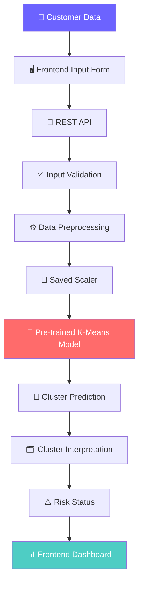
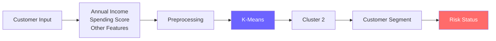
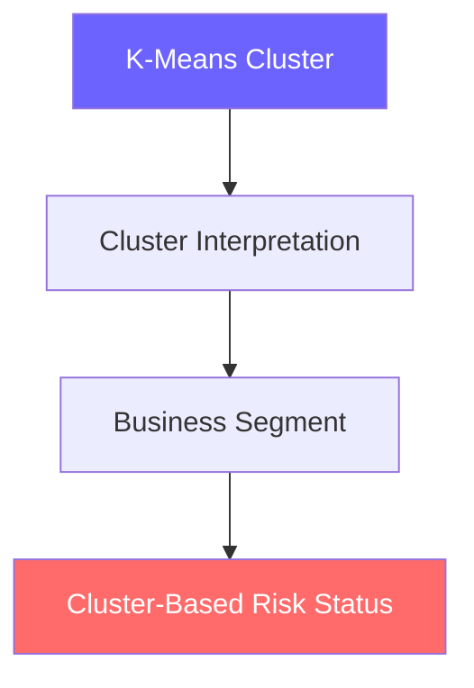
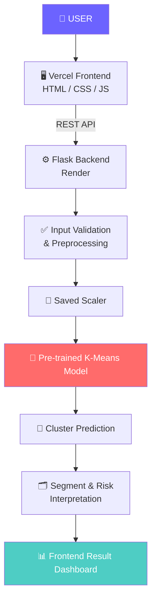

<div align="center">


<br/>

[](https://customer-segmentation-pearl.vercel.app/index.html)
[](https://scikit-learn.org/stable/modules/clustering.html)
[](https://www.python.org/)
[](https://developer.mozilla.org/en-US/docs/Web/JavaScript)
[](https://vercel.com/)


</div>


## 🌐 Live Application

<div align="center">

### 🚀 [**Open Customer Segmentation AI**](https://customer-segmentation-pearl.vercel.app/index.html) 🚀


</div>

The application provides an interactive web interface for analyzing customer behavior using a **pre-trained K-Means clustering model**.

Users can enter customer information and receive:

- 🎯 Customer segment
- 🔮 Predicted cluster
- ⚠️ Cluster-based risk status
- 💡 Customer insights
- 📊 Segment analytics
- 📈 Dataset statistics
- 🧠 Model information

> **Note:** Risk status is a cluster-based business interpretation. K-Means itself does not produce a probability of customer risk.


## 📑 Table of Contents

<details open>
<summary>Click to expand</summary>

- [Project Overview](#-project-overview)
- [Problem Statement](#-problem-statement)
- [Our Solution](#-our-solution)
- [Machine Learning](#-machine-learning)
- [Prediction Pipeline](#-prediction-pipeline)
- [Important ML Note](#️-important-ml-note)
- [Features](#-features)
- [Technology Stack](#️-technology-stack)
- [System Architecture](#️-system-architecture)
- [Frontend Structure](#-frontend-structure)
- [API Integration](#-api-integration)
- [Example Prediction Request](#-example-prediction-request)
- [Running Locally](#-running-the-project-locally)
- [Deployment](#️-deployment)
- [Application Pages](#-application-pages)
- [Future Improvements](#-future-improvements)
- [Possible ML Improvements](#-possible-ml-improvements)
- [Educational Purpose](#-educational-purpose)
- [Project Highlights](#-project-highlights)
- [References](#-references--inspiration)
- [Project Status](#-project-status)
- [License](#-license)

</details>


## 📌 Project Overview

**Customer Segmentation AI** is a Machine Learning-powered web application designed to group customers based on similarities in their behavioral and financial characteristics.

The project uses a **pre-trained K-Means clustering model** to identify customer segments based primarily on customer income and spending behavior.

Instead of simply displaying the ML output as a cluster number, the application converts the cluster into a meaningful customer segment and a corresponding **cluster-based risk status**.

### 🔄 Core Workflow




## 🎯 Problem Statement

Businesses often have customers with very different purchasing behaviors.

Treating every customer in the same way can make it difficult to:

- 🔍 Identify valuable customers
- 🧭 Understand customer behavior
- 📉 Detect low-engagement customers
- 🎯 Create targeted marketing strategies
- ⭐ Prioritize customer engagement
- 📊 Make data-driven decisions

This project addresses the problem by using **unsupervised Machine Learning** to automatically group customers into meaningful behavioral segments.


## 💡 Our Solution

The system uses a pre-trained **K-Means clustering model** to classify a new customer's data into one of the learned clusters.



The application then presents the result through an easy-to-understand dashboard.


## 🧠 Machine Learning

### Algorithm — K-Means Clustering

K-Means is an **unsupervised Machine Learning algorithm** that groups similar data points into a predefined number of clusters.

<div align="center">

| 🔧 Property | 📋 Value |
|:---:|:---:|
| **Algorithm** | K-Means |
| **Clusters** | 5 |
| **Dataset** | 200 customers |
| **Learning Type** | Unsupervised |

</div>

The application uses the trained model for inference rather than retraining it whenever a user submits customer information.


## 🔄 Prediction Pipeline

When a user enters customer information, the request flows through **7 stages**:

<details>
<summary><b>1️⃣ User Input</b></summary>

```json
{
  "age": 25,
  "annual_income": 75000,
  "spending_score": 82
}
```
</details>

<details>
<summary><b>2️⃣ Backend Validation</b></summary>

The API validates the submitted values.
</details>

<details>
<summary><b>3️⃣ Preprocessing</b></summary>

The same preprocessing/scaling used during model training is applied.
</details>

<details>
<summary><b>4️⃣ K-Means Prediction</b></summary>

The saved K-Means model predicts the customer's cluster.

```python
cluster = model.predict(scaled_data)
```
</details>

<details>
<summary><b>5️⃣ Cluster Interpretation</b></summary>

The cluster number is mapped to a meaningful customer segment.
</details>

<details>
<summary><b>6️⃣ Risk Status</b></summary>

A business-rule mapping converts the segment into a cluster-based risk status.
</details>

<details>
<summary><b>7️⃣ Frontend Result</b></summary>

The final result is displayed in the Customer Analysis dashboard.
</details>


## ⚠️ Important ML Note

> K-Means does **not** directly predict customer risk. It identifies groups of customers based on similarity.



The risk status should therefore be understood as a **business interpretation of the customer's cluster**, not a probability generated by the K-Means algorithm.


## ✨ Features

<table>
<tr>
<td width="50%" valign="top">

### 📊 Dashboard
Overview of the customer dataset and segmentation results.
- Total customers
- Number of segments
- Risk distribution
- Customer statistics
- Model overview

</td>
<td width="50%" valign="top">

### 👤 Customer Analysis
Interactive form that runs the trained ML pipeline.
- Cluster
- Customer segment
- Risk status
- Customer insights

</td>
</tr>
<tr>
<td width="50%" valign="top">

### 🧩 Customer Segments
Overview of clusters discovered by the K-Means model.
- Customer count
- Average income
- Average spending behavior
- Risk classification
- Segment description

</td>
<td width="50%" valign="top">

### 📈 Analytics
Visual insights into the customer dataset.
- Income vs Spending visualization
- Segment distribution
- Risk distribution
- Cluster statistics
- Customer behavior analysis

</td>
</tr>
</table>

### 🤖 Model Information

```text
Algorithm          →  K-Means Clustering
Learning Type       →  Unsupervised Learning
Number of Clusters  →  5
Prediction Type     →  Customer Cluster Classification
```


## 🛠️ Technology Stack

<div align="center">

### Frontend


### Backend


### Machine Learning


### Deployment


</div>


## 🏗️ System Architecture




## 📂 Frontend Structure

```text
customer-segmentation-frontend/
│
├── index.html
├── analysis.html
├── analytics.html
├── model.html
├── segments.html
│
├── CSS/
│   └── styles.css
│
├── js/
│   ├── config.js
│   ├── analysis.js
│   ├── analytics.js
│   └── ...
│
└── README.md
```


## 🔌 API Integration

The frontend communicates with the backend through REST APIs.

| Environment | URL |
|---|---|
| 🖥️ **Local Development** | `http://localhost:5000` |
| ☁️ **Production** | `https://customer-segmentation-api-glw9.onrender.com` |

The frontend automatically uses the production API when deployed.


## 📡 Example Prediction Request

```http
POST /api/predict
Content-Type: application/json
```

**Request:**
```json
{
  "age": 25,
  "annual_income": 75000,
  "spending_score": 82
}
```

**Response:**
```json
{
  "success": true,
  "cluster": 2,
  "segment": "Premium Customer",
  "risk_status": "Low Risk"
}
```

> The exact fields and segment names depend on the trained model and backend configuration.


## 🚀 Running the Project Locally

### 1️⃣ Clone the repository

```bash
git clone YOUR_GITHUB_REPOSITORY_URL
cd customer-segmentation
```

### 2️⃣ Start the backend

Create a Python environment:

```bash
python -m venv venv
```

Activate it:

```bash
# Windows
venv\Scripts\activate

# Linux / macOS
source venv/bin/activate
```

Install dependencies:

```bash
pip install -r requirements.txt
```

Start the Flask server:

```bash
python app.py
```

The backend should run on `http://localhost:5000` ✅

### 3️⃣ Run the Frontend

Because the frontend uses HTML/CSS/JavaScript, it can be opened using a local development server.

For example, with VS Code: **Live Server → Open `index.html`**

Or use any static web server.


## ☁️ Deployment

<div align="center">

| Layer | Platform | Link |
|:---:|:---:|:---:|
| 🖥️ **Frontend** | Vercel | [Live Website](https://customer-segmentation-pearl.vercel.app/index.html) |
| ⚙️ **Backend** | Render | [Production API](https://customer-segmentation-api-glw9.onrender.com/) |

</div>


## 📊 Application Pages

| Page | Purpose |
|---|---|
| 🏠 [Dashboard](https://customer-segmentation-pearl.vercel.app/index.html) | Overall customer segmentation overview |
| 👤 [Customer Analysis](https://customer-segmentation-pearl.vercel.app/analysis.html) | Analyze a new customer |
| 🧩 [Segments](https://customer-segmentation-pearl.vercel.app/segments.html) | Explore customer segments |
| 📈 [Analytics](https://customer-segmentation-pearl.vercel.app/analytics.html) | View customer analytics |
| 🧠 [About Model](https://customer-segmentation-pearl.vercel.app/model.html) | Learn about the ML model |


## 📈 Future Improvements

- [ ] Customer lifetime value prediction
- [ ] RFM-based segmentation
- [ ] Customer churn prediction
- [ ] Personalized marketing recommendations
- [ ] Customer similarity search
- [ ] Advanced anomaly detection
- [ ] Multiple clustering algorithms
- [ ] Automatic cluster interpretation
- [ ] Explainable AI
- [ ] Customer behavior forecasting
- [ ] Real-time analytics
- [ ] Authentication and role-based access
- [ ] Database integration
- [ ] Mobile application


## 🔬 Possible ML Improvements

Future versions can compare K-Means with:

- Gaussian Mixture Models
- DBSCAN
- Agglomerative Clustering
- BIRCH

This would allow the project to evaluate whether K-Means is the most appropriate clustering approach for the dataset.

Research on customer segmentation has also compared several clustering approaches, including K-Means, GMM, DBSCAN, agglomerative clustering, and BIRCH.


## 🎓 Educational Purpose

This project demonstrates an end-to-end Machine Learning application:

```mermaid
flowchart LR
    A[Dataset] --> B[Preprocessing]
    B --> C[Feature Selection]
    C --> D[K-Means Training]
    D --> E[Model Serialization]
    E --> F[REST API]
    F --> G[Frontend Integration]
    G --> H[Prediction]
    H --> I[Visualization]
    I --> J[Deployment]

    style A fill:#6C63FF,color:#fff
    style J fill:#4ECDC4,color:#fff
```



It is designed as an educational/portfolio project demonstrating how a trained Machine Learning model can be integrated into a real web application.


## 👨‍💻 Project Highlights

<table>
<tr>
<td valign="top" width="33%">

### 🧠 Machine Learning
- Unsupervised Learning
- K-Means Clustering
- Feature Scaling
- Cluster Interpretation

</td>
<td valign="top" width="33%">

### 💻 Software Development
- REST API
- Frontend ↔ Backend integration
- Model serving
- JSON-based communication
- Error handling

</td>
<td valign="top" width="33%">

### ☁️ Deployment
- Vercel frontend deployment
- Render backend deployment
- Production API integration

</td>
</tr>
</table>


## 📚 References & Inspiration

The project is based on established customer-segmentation approaches using K-Means clustering. Similar open-source implementations include:

- [Customer Segmentation using K-Means](https://github.com/mayursrt/customer-segmentation-using-k-means)
- [K-Means Customer Segmentation — Credit Card Behaviour](https://github.com/erenonal/K-means_customer_segmentation)
- [Customer Segmentation using K-Means Clustering](https://github.com/pantakanch/Customer-Segmentation-using-K-Means-Clustering)
- [Bank Customer Segmentation with K-Means](https://github.com/Thamilini/BankSeg-KMeans)
- [Retail E-Commerce Customer Segmentation](https://github.com/yulianthyho/Olist-Ecommerce-RFM-Customer-Segmentation)

These projects demonstrate common applications of K-Means for identifying customer groups based on behavioral and financial characteristics.


## ⭐ Project Status

<div align="center">

| 🔧 | 📋 |
|:---:|:---:|
| **Status** | 🟢 Deployed |
| **Frontend** | Vercel |
| **Backend** | Render |
| **ML Model** | Pre-trained K-Means |
| **Clusters** | 5 |
| **Dataset** | 200 customers |
| **Application** | Live |

</div>


<div align="center">

## 🚀 Live Demo

### 👉 [**Launch Customer Segmentation AI**](https://customer-segmentation-pearl.vercel.app/index.html) 👈

<br/>

## 📄 License

This project is developed for educational and portfolio purposes.

<br/>


</div>
